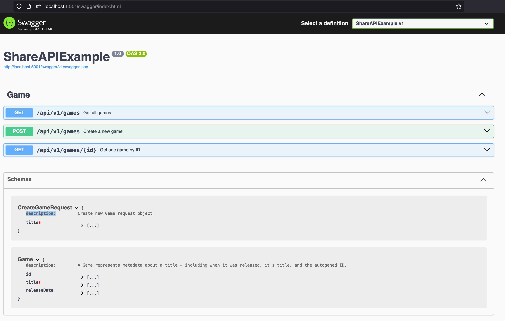

# .NET Fiasco Share API Example

This repository shows how a new .NET/AspNet Core API can be created.

To run locally, install the [dotnet SDK](https://dotnet.microsoft.com/en-us/download) first and verify it's working by running the dotnet CLI command `dotnet --version`.

To run the project, run `dotnet run` from within the project directory `ShareAPIExample`. *(The folder container the .csproj file).*

The project should be running on [localhost:5001](http://localhost:5001). To view the swagger go to [localhost:5001/swagger](http://localhost:5001/swagger) - try interacting with the endpoints via swagger - XML comments in code will be used as descriptions - everything is generated automatically.

The project is split into a [Controllers](./ShareAPIExample/Controllers/) folder for accepting incoming requests, a [Services](./ShareAPIExample/Services/) folder for handling business logic and interacting with DB's and other internal or external services, and a [Models](./ShareAPIExample/Models/) directory for storing data classes.

Data validation of incoming requests (like Zod) can be done via attributes. See line 23 in [Models/Game.cs](./ShareAPIExample/Models/Game.cs#L23)

Swagger screenshot:
